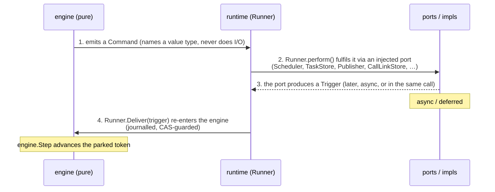
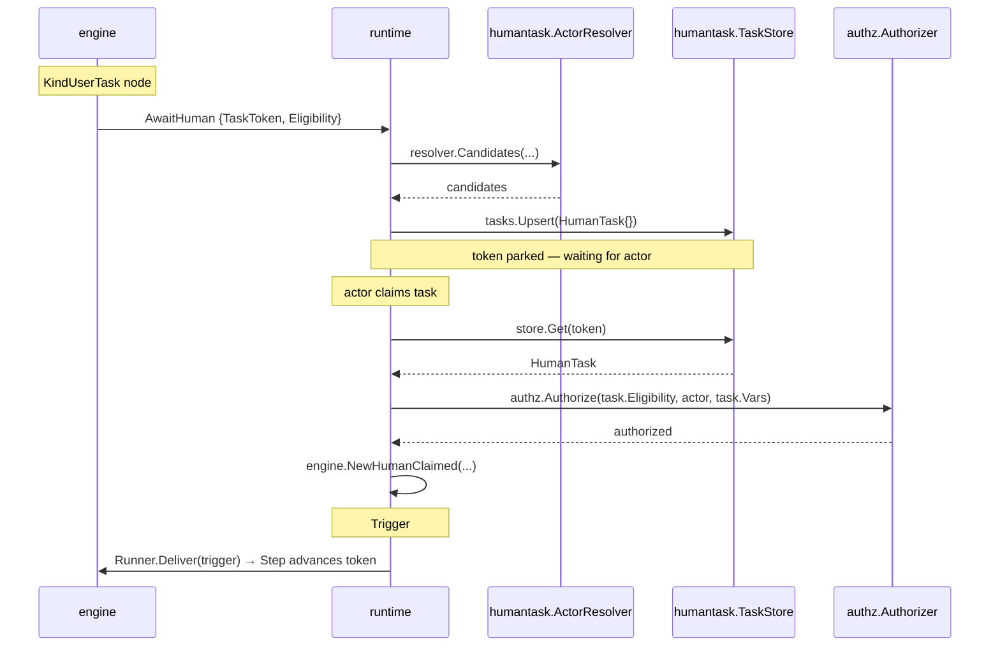
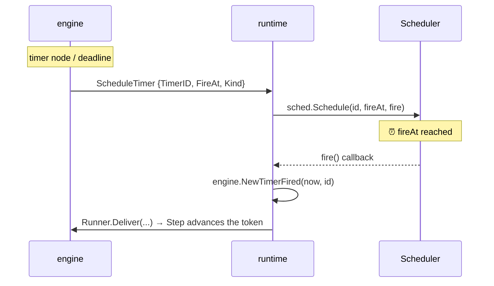
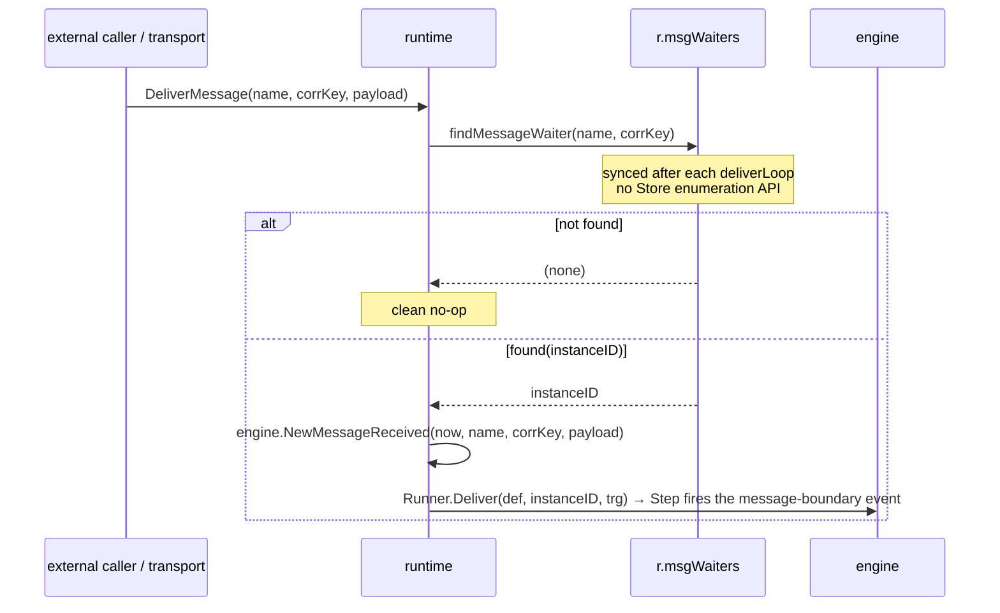
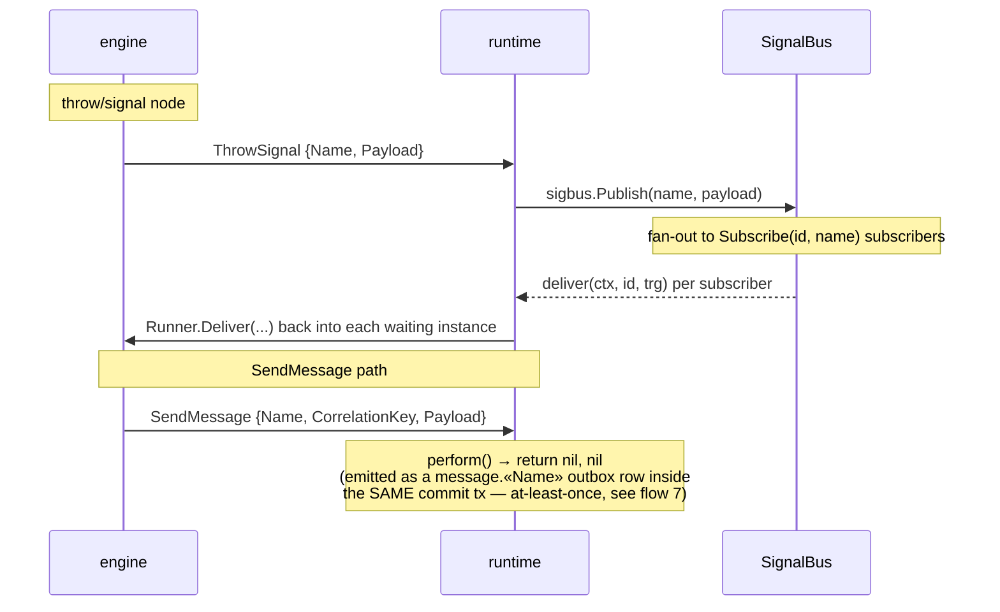
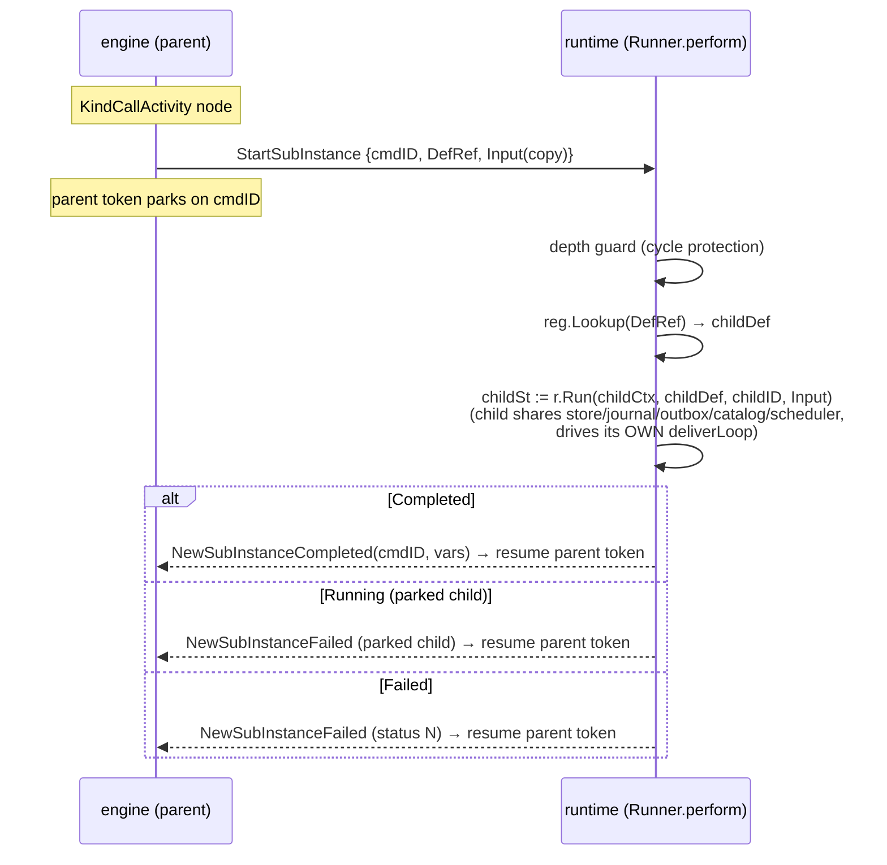
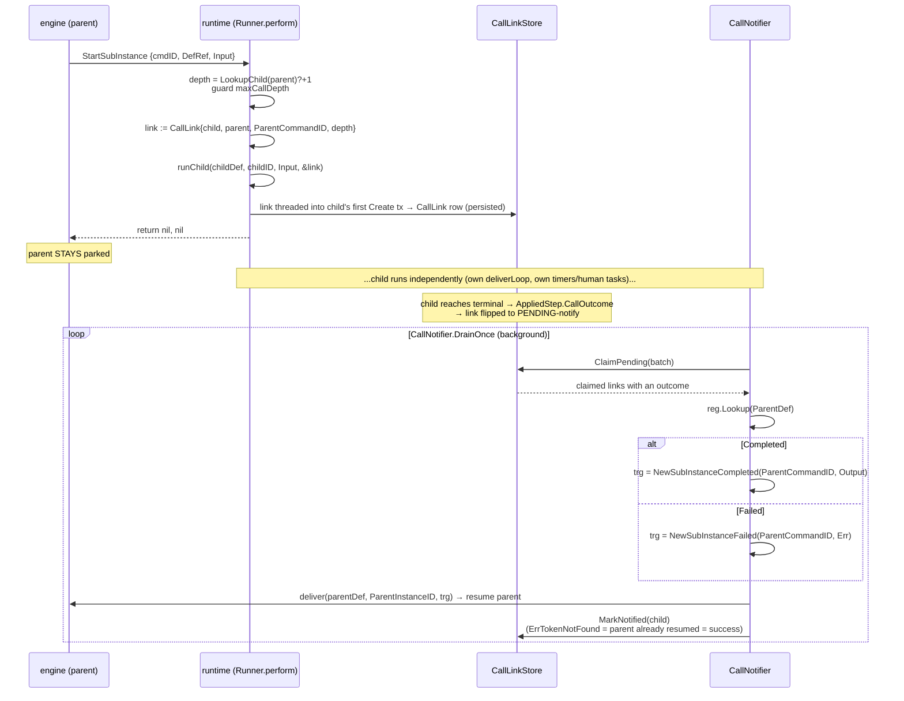
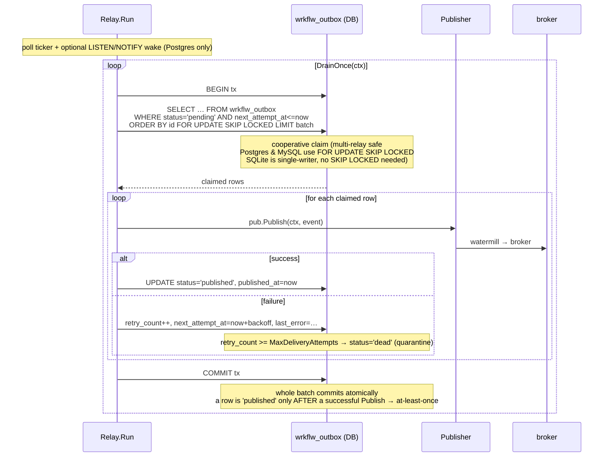

# Interaction Flows

How the packages of `wrkflw` collaborate to drive a process instance. This
document traces each way a parked token is woken and each side effect the engine
requests, following one repeating shape across all of them.

Audience: maintainers and embedding consumers who need to understand the seams
between `engine/` (pure core), `runtime/` (the adapter), the ports, and the
`internal/` implementations — without reading every file.

---

## The unifying pattern

Every interaction obeys the same three-part contract:



Load-bearing invariants:

- The **engine core never touches a clock, scheduler, broker, store, or catalog.**
  It emits commands that *name* value types and parks tokens on a `CommandID` /
  timer ID; it depends on interfaces only.
- The **runtime `Runner` owns every port.** It is the single adapter that turns a
  command into an effect and turns an effect's result back into a trigger.
- **Everything re-enters through `Runner.Deliver`**, keyed by the parked token's
  `AwaitCommand`. A person claiming a task, a timer firing, a retry, a child
  instance completing, and an incident being resolved are all indistinguishable
  to the engine — each is just a `Trigger` applied by one `Step`.
- Delivery back into the engine is **journalled and CAS-guarded** (optimistic
  concurrency via `Store.Commit(expected Token, …)` → `ErrConcurrentUpdate`), so
  concurrent wake-ups (timer vs. message vs. admin) never corrupt state.

### Summary of the flows

| Flow | Engine emits | Runtime port(s) | Trigger back | Async? |
|---|---|---|---|---|
| Human task | `AwaitHuman` / `UpdateTask` | `humantask.TaskStore` + `ActorResolver` + `authz.Authorizer` | `HumanClaimed` / `HumanCompleted` | yes (person) |
| Timer | `ScheduleTimer` / `CancelTimer` | `runtime.Scheduler` (+ `TimerStore`) | `TimerFired` | yes (clock) |
| Inbound message | *(transport-driven)* | internal `msgWaiters` index | `MessageReceived` | yes |
| Signal | `ThrowSignal` | `runtime.SignalBus` | via `DeliverFunc` | yes |
| Send message | `SendMessage` | outbox table (no `perform`) | *(async, subscriber)* | yes |
| Compensation | `InvokeAction` (per record) | `action.Catalog` | `ActionCompleted` (cursor walk) | no |
| Retry | `ScheduleTimer{TimerRetry}` | `runtime.Scheduler` | `TimerFired` → re-invoke | yes |
| Incident resolve | *(admin trigger)* | — | `ResolveIncident` → re-invoke | yes (admin) |
| Sub-process | *(nothing — scope only)* | none (pure engine) | *(token flow)* | no |
| Call activity (sync) | `StartSubInstance` | `DefinitionRegistry` | `SubInstanceCompleted/Failed` | no |
| Call activity (async) | `StartSubInstance` | `DefinitionRegistry` + `CallLinkStore` + `CallNotifier` | `SubInstanceCompleted/Failed` | yes |
| **Eventing / outbox** | *(events derived at commit)* | `Store` (write) + `Publisher` (relay) | *(one-way, to the broker)* | yes |

The last row is the one flow that does **not** wake a parked token — it carries
domain events *out* of the engine to a broker. It is detailed in full below; the
earlier flows are summarized for cross-reference.

---

## 1. Human task

`humantask/` holds pure types + ports; `runtime.TaskService` is the behavioural
adapter. The `Runner` writes tasks into a `humantask.TaskStore`; `TaskService`
reads from it to authorize actor actions.



- `humantask.TaskStore` is the meeting point: `Runner` writes through it
  (`runner.go` `AwaitHuman` case), `TaskService` reads through it
  (`runtime/taskservice.go`).
- `task.Vars` is a variable snapshot taken at task-creation time so attribute-based
  authorization predicates (`vars["region"] == "EU"`) evaluate deterministically.

## 2. Timer

The port is `runtime.Scheduler`; the trigger is `engine.TimerFired`. See also the
**"arm" terminology** note at the end.



- `armTimer` (`runner.go`) registers the timer; the `fire` callback uses a fresh
  `context.Background()` (the request context is long gone) and retries only on
  `ErrConcurrentUpdate`.
- Armed timers are persisted as `AppliedStep.TimerArms` (atomic with state) so
  `RehydrateTimers` can re-arm them after a restart via the `TimerStore` read port.

## 3. Message / signal boundary

Two directions, two ports.

**Inbound** — a transport calls `Runner.DeliverMessage(name, correlationKey)`,
which correlates to a parked instance via an internal `msgWaiters` index (synced
after each `deliverLoop`) and injects `engine.MessageReceived`. No matching waiter
is a clean no-op.



**Outbound** — `engine.ThrowSignal` → `Runner.perform` → `SignalBus.Publish`,
which fans out to subscribed instances through an injected `DeliverFunc` (wrapping
`Runner.Deliver`). `engine.SendMessage` is purely a transactional-outbox event
(see flow 7) — `perform` returns `nil, nil`.



## 4. Compensation / rollback

Two phases: an **undo log** accumulated during forward flow, then replayed in
reverse. The replay reuses the normal `InvokeAction` → `action.Catalog` machinery.

```
PHASE 1 — forward: each activity with a CompensationAction appends a
          CompensationRecord{NodeID, Action, Input} to s.RootCompensations
          (oldest-first). Sub-process scopes archive theirs on close.

PHASE 2 — rollback (admin CompensateRequested trigger, or cancel/error path):
   Runner.Deliver(trigger) ─► stepCompensateRequested → beginCompensation:
     ├─ consolidate archived sub-process records
     ├─ cancel in-flight tokens
     ├─ walk records reverse (len-1 → 0), emit ONE InvokeAction at a time
     │    ◄── each ActionCompleted(cursor.ActiveCmdID) → stepCompensationAdvance
     │        emits the NEXT record's InvokeAction
     └─ stepCompensationFinish:
          full  → clear records, apply FinalStatus
          partial (ToNode!="") → place a token back at ToNode, resume forward
```

- Entry is the `CompensateRequested` **trigger** (not a command). Partial rollback
  does not compensate the `ToNode` target itself — records *after* it are eligible.
- `InvokeCancelAction` is distinct: best-effort cancel-time side effect, no
  `CommandID`, result never fed back (instance already terminal).
- `engine.Compensate{ScopeID, FromNode}` is **RESERVED / not yet emitted**.

## 5. Retry / incident resolution

A retry is a self-scheduled `TimerRetry`; an incident is a parked token awaiting
an operator. Both converge on the shared `reinvokeServiceAction` primitive.

```
InvokeAction fails → ActionFailed{Retryable} ─► handleActionFailed:
  ├─ retryable & budget left? → ScheduleTimer{TimerRetry} (backoff+jitter), park token
  │      ⏰ fires → reinvokeServiceAction → fresh InvokeAction (loop)
  └─ exhausted / non-retryable → precedence:
        (1) RecoveryFlow catch-flow  → route token down recovery path
        (2) error boundary handler   → propagateError catches
        (3) no handler               → raise Incident, PARK token (instance stays alive)
                                              │
                admin: Runner.ResolveIncident ▼ → ResolveIncident trigger
                  → clear incident, grant budget, reinvokeServiceAction (same InvokeAction)
```

- Terminality is decided by the node's effective retry policy: `!Retryable`,
  non-retryable classification, `MaxAttempts`, or `MaxElapsed`.
- `ResolveIncident` is idempotent: unknown/cleared incident is a no-op; a missing
  token clears the record without re-invoking.
- The **DLQ is a separate poison channel** in the *eventing relay* (flow 7), for
  failed event *publication* — not for action execution. Do not conflate them.

## 6. Sub-process vs. call activity

|  | Sub-process (`KindSubProcess`) | Call activity (`KindCallActivity`) |
|---|---|---|
| Boundary | scope inside the *same* instance | a *separate* child instance |
| Mechanism | `openScope`/`closeScope`, token flow | `StartSubInstance` + parked parent token |
| Variables | shared instance space | isolated; copied in, merged on completion |
| Runtime port | none — pure engine | `DefinitionRegistry` (+ async: `CallLinkStore`, `CallNotifier`) |
| Result | token flow (no trigger) | `SubInstanceCompleted` / `SubInstanceFailed` |

**Sub-process** never leaves the engine: entering opens a nested scope and drops
a token on the inner start node; the inner end archives compensations and closes
the scope, resuming the parent flow — all within `drive()`.

```
(a) SUB-PROCESS — pure engine, single instance, within drive()
──────────────────────────────────────────────────────────────
token reaches KindSubProcess node
   ├─ openScope(nodeID, parentScope)  → Scope{ID, ParentID, Compensations:[]}
   ├─ place token on the inner start node INSIDE the new scope
   ├─ consume the outer sub-process token (execution is now "inside")
   └─ arm any KindEventSubProcess nodes in the scope
        │  ...inner tokens flow entirely within drive() — no command, no port...
        ▼
   inner end event reached
   ├─ archiveCompensations(scopeID) → ArchivedCompensations[nodeID]  (for later rollback)
   ├─ closeScope(scopeID)
   └─ re-emit a token on the sub-process node's OUTGOING flow (parent scope)
```

**Call activity (sync, no `CallLinkStore`)** runs the child to completion inline
through the same `Runner` and translates the child's terminal status into the
resume trigger in the same `perform` call. A child that *parks* returns a
diagnosable `SubInstanceFailed` (sync mode can't re-enter a parked child).



**Call activity (async, with `CallLinkStore`)** starts the child non-blocking,
persists a `CallLink` in the child's first transaction, and returns `nil` (parent
stays parked). When the child terminates, its outcome is queued on the link and a
background `CallNotifier.DrainOnce` claims it (`ClaimPending` → `MarkNotified`,
at-least-once) and delivers the resume trigger to the parent via a
`CallDeliverFunc`. `ErrTokenNotFound` counts as success (idempotent). Depth is
bounded via `LookupChild` even for recursive definitions.



---

## 7. Eventing / outbox relay (full detail)

This is the one flow that carries data **out** of the engine rather than waking a
parked token. It uses the **transactional outbox** pattern so a domain event is
never lost and never published without its state change also committing.

`watermill` is confined to `eventing/` and `internal/eventing/watermill`;
`engine/`, `model/`, and `runtime/` never import it. The seam is two ports:
`runtime.Store` (write side, in the state tx) and `runtime.Publisher` (relay side).

### 7a. Write side — events derived and committed atomically with state

The engine does **not** emit an explicit "publish" command. Instead, the `Runner`
*derives* outbox events from the step's result at the terminal / send edge, and
hands them to `Store.Commit` inside the **same transaction** as the new snapshot
and journal append.


Key points:

- The topic is **status-driven**, computed at the `deliverLoop` terminal edge (not
  from the terminal command). This fixed two historical gaps (ADR-0046): a
  cancelled instance (`StatusTerminated`) used to mis-publish `instance.failed`,
  and an admin full-rollback termination used to publish nothing.
- `SendTask` messages ride the *same* outbox as domain events (ADR-0067):
  `outboundMessageEvents` turns each `engine.SendMessage` into a `message.<Name>`
  row, so a sent message is atomic with the state commit and relayed at-least-once
  — there is no separate message sink.
- `OutboxEvent` carries `DefinitionRef` ("defID:version") so a downstream consumer
  (e.g. chaining's `PredecessorDefinitionRef`) can route on the source definition
  (ADR-0047). `DedupKey` and `InstanceID` are populated when the row is read back.
- Because write is inside the state tx, the outbox is part of the **source of
  truth**: if the state commit rolls back, the event does too (never published
  without its state change), and vice versa (never a state change without its
  event queued).

### 7b. Relay side — drain the outbox and publish at-least-once

A background `Relay` (`internal/persistence/store/relay.go`) polls the outbox and
pushes each row to the consumer-supplied `runtime.Publisher`. The consumer builds
the `Publisher` by wrapping any watermill `message.Publisher` with
`eventing.NewPublisher`.



Design properties (ADR-0017, ADR-0022):

- **Cooperative claim.** `FOR UPDATE SKIP LOCKED` lets many `Relay` instances run
  concurrently across replicas without double-publishing — each grabs a disjoint
  batch. Postgres and MySQL support this natively; SQLite is single-writer so
  concurrent relay instances are not applicable.
- **Per-row isolation / no head-of-line blocking.** A failing ("poison") row
  records its own `retry_count` / `next_attempt_at` / `last_error` *in the same
  drain tx* and is skipped; it never rolls back healthy peers already marked
  published in that batch. Healthy lanes proceed while the poison row retries on
  its own capped-exponential-backoff schedule (`RelayBackoff`).
- **Dead-letter quarantine (DLQ).** Once `retry_count` reaches
  `MaxDeliveryAttempts` (default 10) the row moves to `status='dead'` and is no
  longer claimed — isolated for operator inspection instead of retrying forever.
  Admin API on the relay: `ListDeadLettered(limit)` to inspect, `Redrive(ids…)` to
  reset dead rows back to `pending` (retry_count=0, next_attempt_at=now).
- **At-least-once, not at-most-once.** A row becomes `published` only after a
  successful `Publish`; if the tx later fails to commit, the row stays `pending`
  and is re-delivered. Consumers must therefore be **idempotent** (the outbox
  `dedup_key` / a `wrkflw_processed_message` deduper supports this).
- **LISTEN/NOTIFY (optional, `WithListenNotify`).** Postgres-only: the write side
  emits `NOTIFY wrkflw_outbox` on commit; the relay holds a dedicated connection
  that `LISTEN`s and drains immediately, coalescing bursts (`drainUntilEmpty`). The
  poll ticker stays as a fallback for missed notifications, restarts, and
  multi-worker fan-out. MySQL and SQLite rely on the poll ticker only.
- **Ordering.** Global FIFO is not guaranteed once a row fails — its delivery is
  deferred relative to later healthy rows. Ordering loss is bounded to the affected
  row's own lane (its instance/dedup partition).
- **Observability.** `wrkflw_relay_events_published_total` (counter),
  `wrkflw_relay_batch_duration_seconds` (histogram), `wrkflw.relay.batch` spans,
  and `OutboxStats` (pending count, dead count, oldest-pending age) implementing
  `runtime.OutboxStatsReader`.

### 7c. Consumer / subscriber side

The published events are ordinary broker messages the consumer subscribes to with
their own watermill router. Two turnkey helpers live in `eventing/` so `runtime`
stays watermill-free:

- **`eventing.NewGoChannelPublisher`** — an in-process pub/sub (no external broker)
  returning a `runtime.Publisher`, a `message.Subscriber`, and an `io.Closer`.
  Useful for tests and single-process deployments.
- **`eventing.NewMessageHandler`** — consume `message.*` events (from `SendTask`)
  and deliver them to a parked `ReceiveTask` via `Runner.DeliverMessage` (closing
  the loop back to flow 3).
- **`eventing.NewChainHandler` / `NewChainerRunner`** — process-instance chaining
  (ADR-0045): subscribe the three status-accurate terminal topics
  (`instance.completed` / `instance.failed` / `instance.terminated`) and drive the
  `runtime.Chainer` to start a successor instance.

### Where it sits in the unifying pattern

The outbox flow is the pattern **run one-way**: the engine still never imports a
broker; the `Runner` derives events and commits them through the `Store` port
(atomic with state); a separate `Relay` process turns committed rows into
`Publisher` calls with at-least-once delivery, poison isolation, and a DLQ. The
only difference from the wake-up flows is that the result is a message on a broker
rather than a `Trigger` re-entering `Runner.Deliver` — though a consumer's
subscriber (message handler, chainer) frequently *does* loop an event back into
the engine as the next interaction.

---

## Appendix — "arm" terminology

"Arm" is alarm/trigger vocabulary: to *arm* something is to prime it so it fires
later when its condition is met. It is the setup half of a set/fire pair; the
opposite is *disarm* / *cancel*.

- **arm** — register a timer/subscription so it is primed to fire (`armTimer` →
  `sched.Schedule`; armed message boundary events).
- **fire** — the armed callback actually runs (`fire func()`, `NewTimerFired`).
- **disarm / cancel** — remove a still-pending armed item (`CancelTimer` →
  `sched.Cancel`, `TimerCancels`).
- **re-arm** — after a restart, register a persisted armed item again
  (`RehydrateTimers`).

The word captures latency: an armed timer is committed to storage but its effect
is deferred until its deadline fires it or a cancel disarms it — which is exactly
why arms/cancels are tracked as durable side effects (`AppliedStep.TimerArms` /
`TimerCancels`) and re-armed on startup.

---

*This document is a companion to `README.md` and the ADRs under `docs/adr/`. When
a flow changes, update the matching section and the summary table above.*
