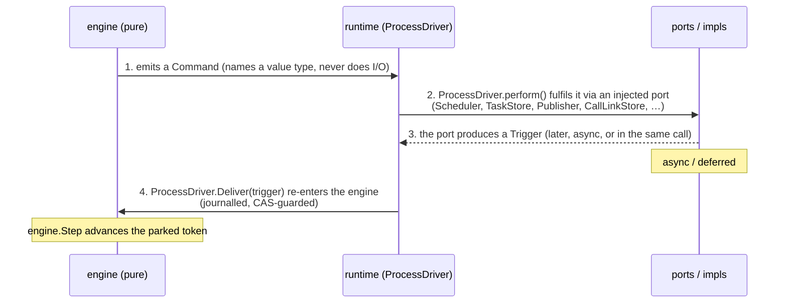
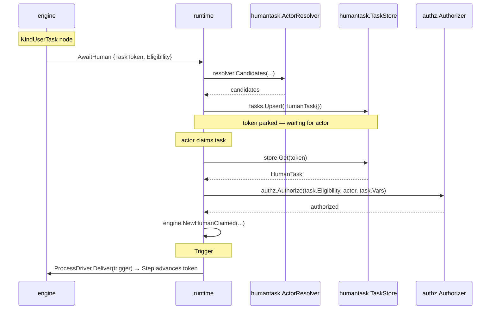
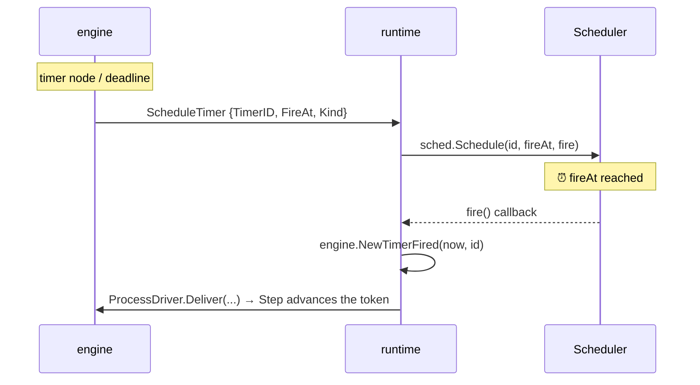
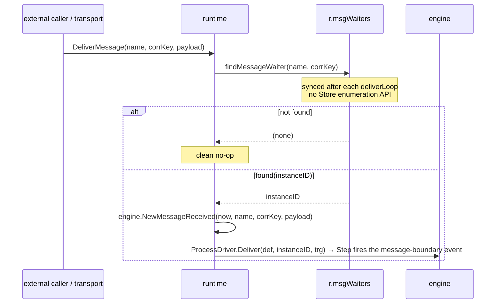
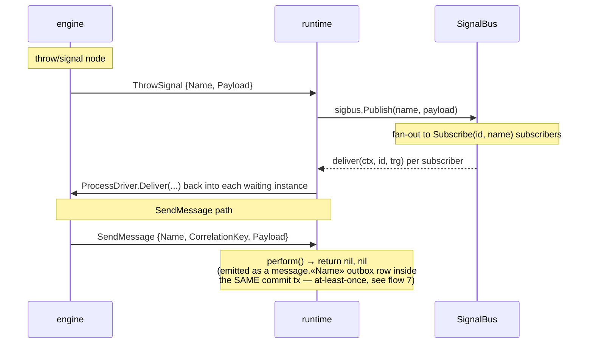
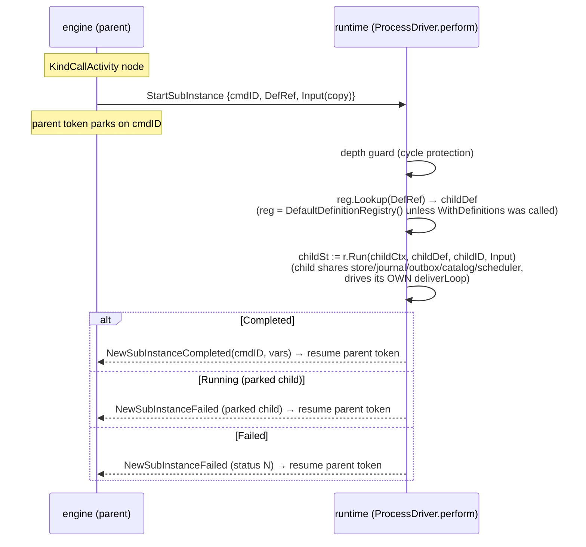
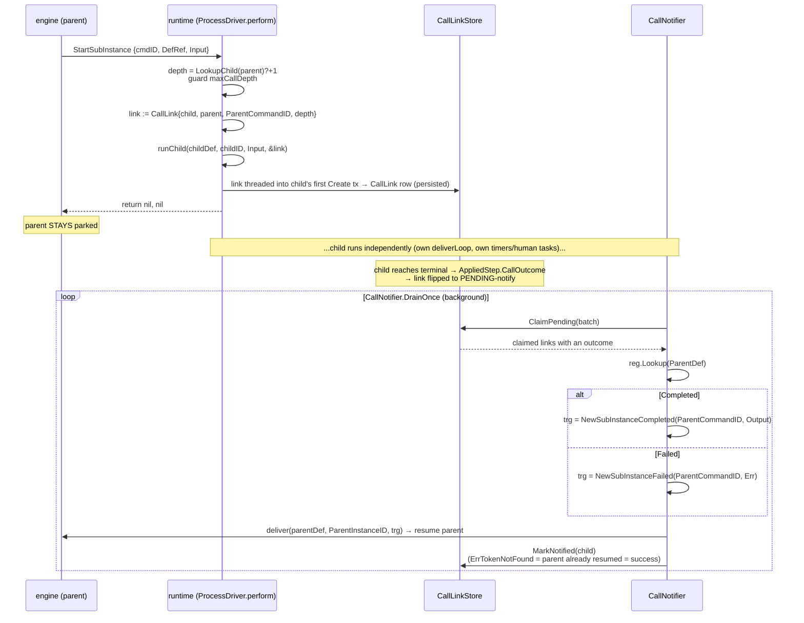
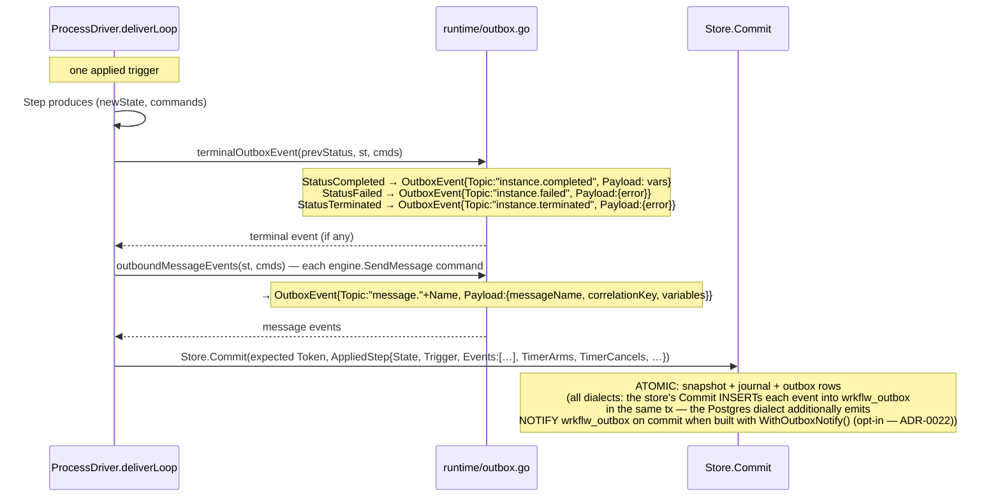
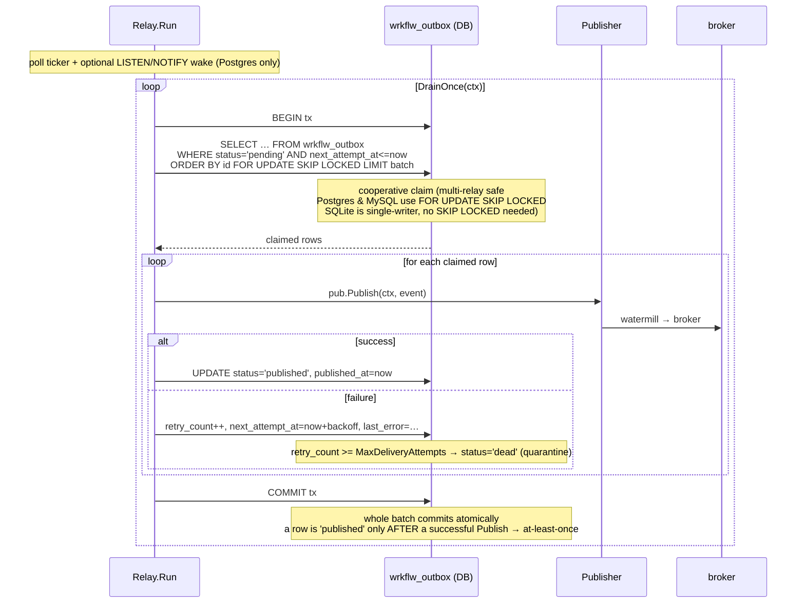

# Interaction Flows

How the packages of `wrkflw` collaborate to drive a process instance. This
document traces each way a parked token is woken and each side effect the engine
requests, following one repeating shape across all of them.

Audience: maintainers and embedding consumers who need to understand the seams
between `engine/` (pure core), `runtime/` (the adapter), the ports, and the
`internal/` implementations — without reading every file.

---

## The unifying pattern

Every interaction obeys the same three-part contract:



Load-bearing invariants:

- The **engine core never touches a clock, scheduler, broker, store, or catalog.**
  It emits commands that *name* value types and parks tokens on a `CommandID` /
  timer ID; it depends on interfaces only.
- The **runtime `ProcessDriver` owns every port.** It is the single adapter that turns a
  command into an effect and turns an effect's result back into a trigger.
- **Everything re-enters through `ProcessDriver.Deliver`**, keyed by the parked token's
  `AwaitCommand`. A person claiming a task, a timer firing, a retry, a child
  instance completing, and an incident being resolved are all indistinguishable
  to the engine — each is just a `Trigger` applied by one `Step`.
- Delivery back into the engine is **journalled and CAS-guarded** (optimistic
  concurrency via `Store.Commit(expected Token, …)` → `ErrConcurrentUpdate`), so
  concurrent wake-ups (timer vs. message vs. admin) never corrupt state.

### Summary of the flows

| Flow | Engine emits | Runtime port(s) | Trigger back | Async? |
|---|---|---|---|---|
| Human task | `AwaitHuman` / `UpdateTask` | `humantask.TaskStore` + `ActorResolver` + `authz.Authorizer` | `HumanClaimed` / `HumanCompleted` | yes (person) |
| Timer | `ScheduleTimer` / `CancelTimer` | `runtime.Scheduler` (+ `TimerStore`) | `TimerFired` | yes (clock) |
| Inbound message | *(transport-driven)* | internal `msgWaiters` index | `MessageReceived` | yes |
| Signal | `ThrowSignal` | `runtime.SignalBus` | via `DeliverFunc` | yes |
| Send message | `SendMessage` | outbox table (no `perform`) | *(async, subscriber)* | yes |
| Compensation | `InvokeAction` (per record) | `action.Catalog` | `ActionCompleted` (cursor walk) | no |
| Retry | `ScheduleTimer{TimerRetry}` | `runtime.Scheduler` | `TimerFired` → re-invoke | yes |
| Incident resolve | *(admin trigger)* | — | `ResolveIncident` → re-invoke | yes (admin) |
| Sub-process | *(nothing — scope only)* | none (pure engine) | *(token flow)* | no |
| Call activity (sync) | `StartSubInstance` | `DefinitionRegistry` (default-global or `WithDefinitions`) | `SubInstanceCompleted/Failed` | no |
| Call activity (async) | `StartSubInstance` | `DefinitionRegistry` (default-global or `WithDefinitions`) + `CallLinkStore` + `CallNotifier` | `SubInstanceCompleted/Failed` | yes |
| **Eventing / outbox** | *(events derived at commit)* | `Store` (write) + `Publisher` (relay) | *(one-way, to the broker)* | yes |

The last row is the one flow that does **not** wake a parked token — it carries
domain events *out* of the engine to a broker. It is detailed in full below; the
earlier flows are summarized for cross-reference.

---

## 1. Human task

**Why this seam exists.** The engine must never do I/O: it cannot call a user
directory, persist a task record, or evaluate a policy. Instead it emits `AwaitHuman`
carrying only a typed value (`TaskToken`, `Eligibility`) and parks the token.
`runtime.ProcessDriver` owns all the side effects: it resolves candidates, writes the task
record, and later reads it back to authorize the claim. `runtime.TaskService` is the
authorization adapter exposed to transport layers so the engine core remains untouched
by any authorization SDK.

**Files to read:** `runtime/runner.go` (`AwaitHuman`/`UpdateTask` cases in
`perform`), `runtime/taskservice.go` (claim/complete/reassign lifecycle),
`humantask/taskstore.go` (port interface), `authz/authz.go` (Authorizer interface).

`humantask/` holds pure types + ports; `runtime.TaskService` is the behavioural
adapter. The `ProcessDriver` writes tasks into a `humantask.TaskStore`; `TaskService`
reads from it to authorize actor actions.



**Guarantees and ownership:**
- `humantask.TaskStore` is the meeting point: `ProcessDriver` writes through it
  (`runner.go` `AwaitHuman` case), `TaskService` reads through it
  (`runtime/taskservice.go`). The store owns persistence; the runner never re-reads
  its own write — the next read happens during claim/complete.
- `task.Vars` is a variable snapshot taken at task-creation time so attribute-based
  authorization predicates (`vars["region"] == "EU"`) evaluate deterministically
  even if process variables later change.
- **Failure path:** if `Upsert` fails, the `perform` call returns an error and the
  runner surfaces it as a retryable `ActionFailed` — the token never parks. If
  `Authorize` returns `ErrNotAuthorized`, `TaskService` propagates it without ever
  delivering a trigger, leaving the token parked. `ErrConcurrentUpdate` on `Deliver`
  retries exactly once (the standard CAS retry path shared by all flows).

## 2. Timer

**Why this seam exists.** The engine must not read the wall clock or call a
scheduler. It emits `ScheduleTimer` carrying the resolved `FireAt` time (computed
from the expression in the definition) and parks. The scheduler is entirely owned
by the runtime — swapping from `MemScheduler` (tests) to `gocron` (production) is
a single constructor option with no engine change.

**Files to read:** `runtime/runner.go` (`armTimer`), `runtime/scheduler.go` (port
interface), `scheduling/scheduler.go` (gocron wrapper), `runtime/memstore.go`
(`MemTimerStore`).

The port is `runtime.Scheduler`; the trigger is `engine.TimerFired`. See also the
**"arm" terminology** note at the end.



**Guarantees and ownership:**
- `armTimer` (`runner.go`) registers the timer and also writes the arm into
  `AppliedStep.TimerArms` inside the same `Store.Commit` transaction (atomic).
  The `fire` callback uses a fresh `context.Background()` (the original request
  context is long gone) and retries on `ErrConcurrentUpdate` — a timer firing
  concurrently with a human-task completion is a normal race; the losing side
  simply retries.
- Armed timers are persisted as `AppliedStep.TimerArms` (atomic with state) so
  `RehydrateTimers` can re-arm them after a process restart via the `TimerStore`
  read port. A timer whose `FireAt` is already past fires immediately, producing an
  idempotent engine no-op if the instance has already advanced.
- `CancelTimer` commands are written into `AppliedStep.TimerCancels` and applied by
  `armTimer`'s cancel path immediately after commit — no separate transaction.
- **`Kind` determines routing** inside `step_timers.go`: `TimerRetry` re-invokes
  the parked service action; `TimerDeadline` routes the token down the deadline's
  escape flow; `TimerInWait` runs the reminder action fire-and-forget (no trigger
  fed back); `TimerIntermediate` resumes the catch-event token.

## 3. Message / signal boundary

**Why this seam exists.** Messages and signals carry data _into_ a parked token
from outside. The engine never sends or receives a message; it parks a token with
an `AwaitMessage` / `AwaitSignal` field. The runtime owns the correlation table
(`msgWaiters`) and the fan-out bus (`SignalBus`) so a single trigger path covers
both external transport calls and inter-instance signals.

**Files to read:** `runtime/runner.go` (`deliverMessage`, `armSignal`, `Sync`
for the `msgWaiters` update), `runtime/broadcast.go` (`SignalBus`),
`engine/step_triggers.go` (`handleMessageReceived`, `handleSignalReceived`).

Two directions, two ports.

**Inbound** — a transport calls `ProcessDriver.DeliverMessage(name, correlationKey)`,
which correlates to a parked instance via an internal `msgWaiters` index (synced
after each `deliverLoop`) and injects `engine.MessageReceived`. No matching waiter
is a clean no-op.



**Guarantees and ownership (inbound):** `msgWaiters` is an in-memory map; it is
rebuilt from `InstanceState` after every `deliverLoop` pass. It survives restarts
only if the consumer calls `ProcessDriver.Sync` on process startup (not currently
exposed — the `MemInstanceStore` path is restart-free by construction; the SQL-backed path
relies on a fresh `Run`/`Deliver` call per instance to re-register). A message with
no waiter is silently dropped — the transport is responsible for retry if the
receive task has not yet armed.

**Outbound** — `engine.ThrowSignal` → `ProcessDriver.perform` → `SignalBus.Publish`,
which fans out to subscribed instances through an injected `DeliverFunc` (wrapping
`ProcessDriver.Deliver`). `engine.SendMessage` is purely a transactional-outbox event
(see flow 7) — `perform` returns `nil, nil`.



**Guarantees and ownership (outbound signals):** `SignalBus.Publish` is synchronous
and in-process: all subscribed `DeliverFunc` callbacks run before `Publish` returns.
Subscription is per `(instanceID, signalName)` pair; `ProcessDriver.Sync` re-registers
after each `deliverLoop`. If `Deliver` fails for a given subscriber the error is
returned from `Publish`, the signal delivery attempt counts as failed, and the
engine records the throw command as failed — no at-least-once guarantee for signals.
Signals are therefore best-effort fan-out; for durable delivery use the outbox
(SendMessage) instead.

## 4. Compensation / rollback

**Why this seam exists.** Compensation is pure engine logic: the undo-log
accumulation, cursor walk, and status transitions happen entirely inside
`engine.Step`. The only external seam is the catalog lookup for each compensation
action, which follows the normal `InvokeAction` path. No new port is introduced.

**Files to read:** `engine/step_compensation.go` (`beginCompensation`,
`stepCompensationAdvance`, `stepCompensationFinish`), `engine/state.go`
(`CompensationRecord`, `ArchivedCompensations`).

Two phases: an **undo log** accumulated during forward flow, then replayed in
reverse. The replay reuses the normal `InvokeAction` → `action.Catalog` machinery.

```
PHASE 1 — forward: each activity with a CompensateAction appends a
          CompensationRecord{NodeID, Action, Input} to s.RootCompensations
          (oldest-first). Sub-process scopes archive theirs on close.

PHASE 2 — rollback (admin CompensateRequested trigger, or cancel/error path):
   ProcessDriver.Deliver(trigger) ─► stepCompensateRequested → beginCompensation:
     ├─ consolidate archived sub-process records
     ├─ cancel in-flight tokens
     ├─ walk records reverse (len-1 → 0), emit ONE InvokeAction at a time
     │    ◄── each ActionCompleted(cursor.ActiveCmdID) → stepCompensationAdvance
     │        emits the NEXT record's InvokeAction
     └─ stepCompensationFinish:
          full  → clear records, apply FinalStatus
          partial (ToNode!="") → place a token back at ToNode, resume forward
```

**Guarantees and ownership:**
- Entry is the `CompensateRequested` **trigger** (not a command). Partial rollback
  does not compensate the `ToNode` target itself — records *after* it are eligible.
- Each compensation action runs through the normal `InvokeAction` → catalog path;
  its `ActionCompleted` advances the cursor. An action failure during compensation
  is currently not caught — the compensation walk still advances (best-effort
  semantics). The state persists at each `ActionCompleted` commit, so a crash
  mid-walk resumes from the correct cursor on the next `Deliver`.
- `InvokeCancelAction` is distinct: best-effort cancel-time side effect, no
  `CommandID`, result never fed back (instance already terminal).
- `engine.Compensate{ScopeID, FromNode}` is **RESERVED / not yet emitted**.

## 5. Retry / incident resolution

**Why this seam exists.** Retry logic is pure engine arithmetic (backoff, budget),
but the timer that defers re-invocation is a side effect. The engine emits
`ScheduleTimer{TimerRetry}` and parks; the runtime arms it via the same `Scheduler`
port used by all timers. Incidents are persisted inside `InstanceState.Incidents` —
no external port is needed to raise one — but clearing an incident requires an
external trigger (`ResolveIncident`) from an admin flow (the HTTP admin route or a direct
`ProcessDriver.ResolveIncident` call).

**Files to read:** `engine/step_timers.go` (`handleTimerFired`, `reinvokeServiceAction`),
`engine/step_triggers.go` (`handleActionFailed`, `handleResolveIncident`),
`runtime/runner.go` (`perform` error-branch, `ResolveIncident`).

A retry is a self-scheduled `TimerRetry`; an incident is a parked token awaiting
an operator. Both converge on the shared `reinvokeServiceAction` primitive.

```
InvokeAction fails → ActionFailed{Retryable} ─► handleActionFailed:
  ├─ retryable & budget left? → ScheduleTimer{TimerRetry} (backoff+jitter), park token
  │      ⏰ fires → reinvokeServiceAction → fresh InvokeAction (loop)
  └─ exhausted / non-retryable → precedence:
        (1) RecoveryFlow catch-flow  → route token down recovery path
        (2) error boundary handler   → propagateError catches
        (3) no handler               → raise Incident, PARK token (instance stays alive)
                                              │
                admin: ProcessDriver.ResolveIncident ▼ → ResolveIncident trigger
                  → clear incident, grant budget, reinvokeServiceAction (same InvokeAction)
```

**Guarantees and ownership:**
- Terminality is decided by the node's effective retry policy: `!Retryable`,
  non-retryable classification, `MaxAttempts`, or `MaxElapsed`.
- `ActionFailed.JitterFraction` (set by the runner's `JitterSource` via
  `engine.WithJitter`) de-synchronizes concurrent retry schedules. Construct via
  `engine.NewActionFailed(at, commandID, errMsg, retryable, engine.WithJitter(fraction))`;
  `fraction` is dimensionless (0–1) and multiplied against the computed backoff
  interval inside `step_timers.go`.
- `ResolveIncident` is idempotent: unknown/cleared incident is a no-op; a missing
  token clears the record without re-invoking.
- The **DLQ is a separate poison channel** in the *eventing relay* (flow 7), for
  failed event *publication* — not for action execution. Do not conflate them.

## 6. Sub-process vs. call activity

**Why this seam exists.** Sub-processes are pure scope nesting handled entirely in
`drive()` — no new port, no state outside the instance. Call activities spawn a
genuinely separate instance, so they need a `DefinitionRegistry` to resolve the
child definition and (in async mode) a `CallLinkStore` to durably correlate the
child's terminal event back to the parked parent token.

**Files to read:** `engine/step_nodes.go` (sub-process strategy, call-activity
strategy), `runtime/runner.go` (`startSubInstance`, `callActivityAsync`),
`runtime/call_notifier.go` (`DrainOnce`, `ClaimPending`, `MarkNotified`).

|  | Sub-process (`KindSubProcess`) | Call activity (`KindCallActivity`) |
|---|---|---|
| Boundary | scope inside the *same* instance | a *separate* child instance |
| Mechanism | `openScope`/`closeScope`, token flow | `StartSubInstance` + parked parent token |
| Variables | shared instance space | isolated; copied in, merged on completion |
| Runtime port | none — pure engine | `DefinitionRegistry` (+ async: `CallLinkStore`, `CallNotifier`) |
| Result | token flow (no trigger) | `SubInstanceCompleted` / `SubInstanceFailed` |

**Sub-process** never leaves the engine: entering opens a nested scope and drops
a token on the inner start node; the inner end archives compensations and closes
the scope, resuming the parent flow — all within `drive()`.

```
(a) SUB-PROCESS — pure engine, single instance, within drive()
──────────────────────────────────────────────────────────────
token reaches KindSubProcess node
   ├─ openScope(nodeID, parentScope)  → Scope{ID, ParentID, Compensations:[]}
   ├─ place token on the inner start node INSIDE the new scope
   ├─ consume the outer sub-process token (execution is now "inside")
   └─ arm any event-triggered SubProcess nodes in the scope (ADR-0122)
        │  ...inner tokens flow entirely within drive() — no command, no port...
        ▼
   inner end event reached
   ├─ archiveCompensations(scopeID) → ArchivedCompensations[nodeID]  (for later rollback)
   ├─ closeScope(scopeID)
   └─ re-emit a token on the sub-process node's OUTGOING flow (parent scope)
```

**`DefinitionRegistry` wiring.** The driver must be able to resolve a `KindCallActivity`
node's `DefRef` string to a `*model.ProcessDefinition`. There are two ways to supply
this:

- **Process-global default (zero-config):** call `runtime.RegisterDefinition(def)` or
  `runtime.MustRegisterDefinition(def)` at program start. `NewProcessDriver()` uses
  `runtime.DefaultDefinitionRegistry()` automatically — no `WithDefinitions` needed.
  Definitions are indexed under both `"<ID>"` and `"<ID>:<Version>"` so either form of
  `DefRef` resolves. Bare `"<ID>"` resolves to the most recently registered version.
  Test-isolation caveat: the global is process-wide; tests must use unique IDs or pass
  `WithDefinitions(kernel.NewMemDefinitionRegistry())` to avoid cross-test collisions.
- **Explicit per-driver registry:** `runtime.WithDefinitions(reg)` overrides the default.
  Passing `nil` is a no-op — the default stands. Use an explicit registry when you need
  multiple driver instances with different definition sets, or for strict test isolation.

**Call activity (sync, no `CallLinkStore`)** runs the child to completion inline
through the same `ProcessDriver` and translates the child's terminal status into the
resume trigger in the same `perform` call. A child that *parks* returns a
diagnosable `SubInstanceFailed` (sync mode can't re-enter a parked child).



**Guarantees and ownership (sync path):** the child shares the parent's store,
catalog, and scheduler. A child that parks (user task, async wait) causes the sync
path to return `SubInstanceFailed` immediately — sync mode cannot re-enter a parked
child. Use sync only when definitions are guaranteed to run to completion without
human tasks or long-running async waits.

**Call activity (async, with `CallLinkStore`)** starts the child non-blocking,
persists a `CallLink` in the child's first transaction, and returns `nil` (parent
stays parked). When the child terminates, its outcome is queued on the link and a
background `CallNotifier.DrainOnce` claims it (`ClaimPending` → `MarkNotified`,
at-least-once) and delivers the resume trigger to the parent via a
`CallDeliverFunc`. `ErrTokenNotFound` counts as success (idempotent). Depth is
bounded via `LookupChild` even for recursive definitions.



---

**Guarantees and ownership (async path):** the `CallLink` row is written inside the
child's first `Store.Create` transaction, so the link either exists or the child
instance does not. `ClaimPending` uses `FOR UPDATE SKIP LOCKED` (Postgres/MySQL) so
concurrent `CallNotifier` replicas never double-deliver. `ErrTokenNotFound` from
`Deliver` is idempotent success (parent already resumed, e.g. by a concurrent
admin action). The child's cancel (`CancelInstance`) propagates recursively when
`WithCallLinkStore` and `WithDefinitions` are both wired.

---

## 7. Eventing / outbox relay (full detail)

**Why this seam exists.** The engine cannot call a broker. Domain events must be
atomic with their state change (if the state commits, the event is queued; if the
state rolls back, the event disappears). The transactional outbox achieves this by
treating the event queue as rows in the same database. A separate `Relay` process
publishes rows to the broker at-least-once without ever touching the state transaction.
Watermill is confined entirely to `eventing/` so the engine and runtime remain
broker-agnostic.

**Files to read:** `runtime/outbox.go` (event derivation),
`internal/persistence/store/store.go` (`Commit` outbox insert),
`internal/persistence/store/relay.go` (drain + backoff + dead-letter),
`eventing/eventing.go` (watermill publisher wrapper), `eventing/chaining.go`
(chain handler).

This is the one flow that carries data **out** of the engine rather than waking a
parked token. It uses the **transactional outbox** pattern so a domain event is
never lost and never published without its state change also committing.

`watermill` is confined to `eventing/` and `internal/eventing/watermill`;
`engine/`, `model/`, and `runtime/` never import it. The seam is two ports:
`runtime.Store` (write side, in the state tx) and `runtime.Publisher` (relay side).

### 7a. Write side — events derived and committed atomically with state

The engine does **not** emit an explicit "publish" command. Instead, the `ProcessDriver`
*derives* outbox events from the step's result at the terminal / send edge, and
hands them to `Store.Commit` inside the **same transaction** as the new snapshot
and journal append.



Key points:

- The topic is **status-driven**, computed at the `deliverLoop` terminal edge (not
  from the terminal command). This fixed two historical gaps (ADR-0046): a
  cancelled instance (`StatusTerminated`) used to mis-publish `instance.failed`,
  and an admin full-rollback termination used to publish nothing.
- `SendTask` messages ride the *same* outbox as domain events (ADR-0067):
  `outboundMessageEvents` turns each `engine.SendMessage` into a `message.<Name>`
  row, so a sent message is atomic with the state commit and relayed at-least-once
  — there is no separate message sink.
- `OutboxEvent` carries `DefinitionRef` ("defID:version") so a downstream consumer
  (e.g. chaining's `PredecessorDefinitionRef`) can route on the source definition
  (ADR-0047). `DedupKey` and `InstanceID` are populated when the row is read back.
- Because write is inside the state tx, the outbox is part of the **source of
  truth**: if the state commit rolls back, the event does too (never published
  without its state change), and vice versa (never a state change without its
  event queued).

### 7b. Relay side — drain the outbox and publish at-least-once

A background `Relay` (`internal/persistence/store/relay.go`) polls the outbox and
pushes each row to the consumer-supplied `runtime.Publisher`. The consumer builds
the `Publisher` by wrapping any watermill `message.Publisher` with
`eventing.NewPublisher`.



Design properties (ADR-0017, ADR-0022):

- **Cooperative claim.** `FOR UPDATE SKIP LOCKED` lets many `Relay` instances run
  concurrently across replicas without double-publishing — each grabs a disjoint
  batch. Postgres and MySQL support this natively; SQLite is single-writer so
  concurrent relay instances are not applicable.
- **Per-row isolation / no head-of-line blocking.** A failing ("poison") row
  records its own `retry_count` / `next_attempt_at` / `last_error` *in the same
  drain tx* and is skipped; it never rolls back healthy peers already marked
  published in that batch. Healthy lanes proceed while the poison row retries on
  its own capped-exponential-backoff schedule (`RelayBackoff`).
- **Dead-letter quarantine (DLQ).** Once `retry_count` reaches
  `MaxDeliveryAttempts` (default 10) the row moves to `status='dead'` and is no
  longer claimed — isolated for operator inspection instead of retrying forever.
  Admin API on the relay: `ListDeadLettered(limit)` to inspect, `Redrive(ids…)` to
  reset dead rows back to `pending` (retry_count=0, next_attempt_at=now).
- **At-least-once, not at-most-once.** A row becomes `published` only after a
  successful `Publish`; if the tx later fails to commit, the row stays `pending`
  and is re-delivered. Consumers must therefore be **idempotent** (the outbox
  `dedup_key` / a `wrkflw_processed_message` deduper supports this).
- **LISTEN/NOTIFY (optional, `WithListenNotify`).** Postgres-only: the write side
  emits `NOTIFY wrkflw_outbox` on commit; the relay holds a dedicated connection
  that `LISTEN`s and drains immediately, coalescing bursts (`drainUntilEmpty`). The
  poll ticker stays as a fallback for missed notifications, restarts, and
  multi-worker fan-out. MySQL and SQLite rely on the poll ticker only.
- **Ordering.** Global FIFO is not guaranteed once a row fails — its delivery is
  deferred relative to later healthy rows. Ordering loss is bounded to the affected
  row's own lane (its instance/dedup partition).
- **Observability.** `wrkflw_relay_events_published_total` (counter),
  `wrkflw_relay_batch_duration_seconds` (histogram), `wrkflw.relay.batch` spans,
  and `OutboxStats` (pending count, dead count, oldest-pending age) implementing
  `runtime.OutboxStatsReader`.

### 7c. Consumer / subscriber side

The published events are ordinary broker messages the consumer subscribes to with
their own watermill router. Two turnkey helpers live in `eventing/` so `runtime`
stays watermill-free:

- **`eventing.NewGoChannelPublisher`** — an in-process pub/sub (no external broker)
  returning a `runtime.Publisher`, a `message.Subscriber`, and an `io.Closer`.
  Useful for tests and single-process deployments.
- **`eventing.NewMessageHandler`** — consume `message.*` events (from `SendTask`)
  and deliver them to a parked `ReceiveTask` via `ProcessDriver.DeliverMessage` (closing
  the loop back to flow 3).
- **`eventing.NewChainHandler` / `NewChainerRunner`** — process-instance chaining
  (ADR-0045): subscribe the three status-accurate terminal topics
  (`instance.completed` / `instance.failed` / `instance.terminated`) and drive the
  `runtime.Chainer` to start a successor instance.

### Where it sits in the unifying pattern

The outbox flow is the pattern **run one-way**: the engine still never imports a
broker; the `ProcessDriver` derives events and commits them through the `Store` port
(atomic with state); a separate `Relay` process turns committed rows into
`Publisher` calls with at-least-once delivery, poison isolation, and a DLQ. The
only difference from the wake-up flows is that the result is a message on a broker
rather than a `Trigger` re-entering `ProcessDriver.Deliver` — though a consumer's
subscriber (message handler, chainer) frequently *does* loop an event back into
the engine as the next interaction.

---

## 8. Constructor conventions

Every stateful object in this library that holds a required, non-nilable dependency
returns `(T, error)` from its constructor. This is the **fail-fast** rule: if a
required interface is nil at construction time, you get a clear error immediately
rather than a panic buried inside the first method call.

### The rule

A constructor returns `(T, error)` when **all** of these hold:
1. The type is stateful (holds fields that survive the call).
2. At least one parameter is a required, non-nilable dependency (interface or pointer).
3. The type is created at wire-up time, not at every request.

A constructor returns `T` (no error) when:
- It builds a pure value type (no I/O, no lifecycle), or
- All parameters are optional / safe to omit.

### Affected constructors (all now return `(T, error)`)

| Constructor | Sentinel when nil dep |
|---|---|
| `runtime.NewProcessDriver(opts...)` | only a default `MemInstanceStore` construction failure (practically never); nil option args are silently ignored, so defaults stand |
| `task.NewTaskService(store, az, opts...)` | `kernel.ErrNilDependency` |
| `kernel.NewCachingInstanceStore(backing, owner, opts...)` | `kernel.ErrNilDependency` |
| `kernel.NewCachingDefinitionRegistry(backing, ttl, opts...)` | `kernel.ErrNilDependency` |
| `signal.NewSignalBus(deliver, opts...)` | `kernel.ErrNilDependency` |
| `calllink.NewCallNotifier(cl, deliver, reg, opts...)` | `kernel.ErrNilDependency` |
| `chain.NewChainer(starter, policy, opts...)` | `kernel.ErrNilDependency` |
| `monitor.NewLineageReader(calls, chains)` | `kernel.ErrNilDependency` |
| `kernel.NewMemInstanceStore(opts...)` | `kernel.ErrNilDependency` (option validation) |
| `internal/persistence/store` constructors | `store.ErrNilDependency` |

Sentinel values:
- `kernel.ErrNilDependency` = `"workflow-runtime: nil required dependency"` (in `runtime/kernel/errors_construct.go`)
- `store.ErrNilDependency` = `"workflow-store: nil required dependency"` (internal; exposed via persistence façade errors)

Both follow the `"workflow-<package>: ..."` prefix convention (ADR-0026).

### Functional-options collapse

Three APIs consolidated multiple old constructors into a single constructor plus options:

**`kernel.NewMemInstanceStore(opts ...MemInstanceStoreOption) (*MemInstanceStore, error)`**

Options: `kernel.WithCallLinks(cl *MemCallLinkStore)`, `kernel.WithTimers(mts *MemTimerStore)`.
Either, both, or neither may be passed; the zero-option call tracks neither.

```go
cl  := kernel.NewMemCallLinkStore()
mts := kernel.NewMemTimerStore()
store, err := kernel.NewMemInstanceStore(
    kernel.WithCallLinks(cl),
    kernel.WithTimers(mts),
)
```

**`engine.NewActionFailed(at, commandID, errMsg, retryable, opts ...ActionFailedOption) ActionFailed`**

Replaces the old `NewActionFailed` + `NewActionFailedJittered`. The value type is
unchanged (no new error path); the option `engine.WithJitter(fraction float64)` sets
`ActionFailed.JitterFraction`. Calling with no options is identical to the old form.

**`casbinauthz.NewCasbinAuthorizer(opts ...Option) (authz.Authorizer, io.Closer, error)`**

Replaces the old `NewCasbinAuthorizer(e)` / `NewCasbinAuthorizerFromStrings` /
`NewCasbinAuthorizerFromDB`. Exactly one source option must be passed:
- `casbinauthz.FromEnforcer(e *casbinv2.SyncedEnforcer)` — wraps a consumer-built enforcer.
- `casbinauthz.FromStrings(modelText, policyText string)` — builds from inline text.
- `casbinauthz.FromDB(ctx, pool, opts ...DBOption)` — builds from a live Postgres pool.

Zero or multiple source options return an error. `io.Closer` is non-nil only for
`FromDB` (watcher goroutine); for the others it is nil, but callers should always
call `closer.Close()` if non-nil.

### When a constructor does NOT return an error

Value types, triggers, and stateless helpers keep their simple form:
- `definition.NewBuilder(id, version)` — returns `*build.Builder` (no deps, no I/O).
- `engine.NewStartInstance(at, vars)` — returns an `engine.StartInstance` value.
- `action.NewMapCatalog(m)` — stateless read-only wrapper (no required interface).
- `humantask.NewMemTaskStore()` — no required non-nilable dep.

---

## 9. Builder vs. Loader

The `definition` root package is a thin authoring aggregator with two entry points,
one for Go-authored definitions and one for YAML-loaded ones. Both produce a
`*model.ProcessDefinition`; the underlying `model.DefinitionBuilder` /
`model.DefinitionLoader` interfaces (in `definition/model`) share the same core and
differ only in what they expose.

### `definition.NewBuilder` — full authoring surface

`definition.NewBuilder(id, version)` returns the **concrete** `*build.Builder`, which
layers one fluent `Add<Kind>` per node kind over the node-agnostic
`model.DefinitionBuilder` interface:

```go
// Concrete *build.Builder (definition/build): fluent per-kind sugar + the interface below.
func (b *Builder) AddServiceTask(id string, opts ...activity.ServiceTaskOption) *Builder
func (b *Builder) AddUserTask(id string, roles []string, opts ...activity.UserTaskOption) *Builder
// ... one AddX per node kind (event / gateway / activity) ...

// Underlying model.DefinitionBuilder interface (definition/model), node-agnostic:
type DefinitionBuilder interface {
    Add(n Node) DefinitionBuilder
    Connect(fromID, toID string, opts ...flow.Option) DefinitionBuilder
    RegisterAction(name string, a action.Action) DefinitionBuilder
    RegisterActionFunc(name string, fn func(context.Context, map[string]any) (map[string]any, error)) DefinitionBuilder
    CancelActions(names ...string) DefinitionBuilder
    Build() (*ProcessDefinition, error)
    Loader() DefinitionLoader
}
```

Structural elements (nodes, flows) and action registrations can be chained in any
order — both the "actions-first" and "structure-first" idioms compile identically
because every mutating method returns the builder. `Build()` assembles, validates,
and locks the scoped action catalog. (A lower-level `model.NewBuilder(id, version)`
returns the node-agnostic interface — `Add` only, no per-kind sugar — for programmatic
construction.)

### `model.DefinitionLoader` — post-parse, actions only

```go
type DefinitionLoader interface {
    RegisterAction(name string, a action.Action) DefinitionLoader
    RegisterActionFunc(name string, fn func(...) (...)) DefinitionLoader
    CancelActions(names ...string) DefinitionLoader
    Build() (*ProcessDefinition, error)
}
```

`definition.NewLoader(r io.Reader)` parses the YAML and returns a `DefinitionLoader`.
The structural elements (nodes, flows, kind, options) are all decoded from YAML —
the `DefinitionLoader` has no `Add*` or `Connect` methods because the structure is
already declared. It exposes only what YAML cannot carry: **runtime action
registrations** (Go function values cannot be serialized).

### Why YAML can't carry `RegisterAction`

A YAML file can name an action (`action: charge-card`) but it cannot embed a Go
function. The load → register-actions → `Build()` sequence is therefore mandatory
for any YAML-loaded definition that uses definition-scoped actions:

```go
ld, err := definition.NewLoader(r) // r is any io.Reader
if err != nil {
    return err
}
ld.RegisterAction("charge-card", myChargeAction)
ld.RegisterAction("refund-card", myRefundAction)
def, err := ld.Build()
```

`Build()` validates the definition and compiles the scoped action catalog from the
registered actions. Calling `Build()` without registering any actions is valid (the
definition uses the global catalog only). Registering the same name twice returns
`model.ErrDuplicateScopedAction` from `Build()`.

### The `Loader()` bridge

The builder exposes a `.Loader()` method that returns a `model.DefinitionLoader`
backed by the same core. This allows passing a builder to code that only needs the
loader API (e.g. a test helper that only registers actions):

```go
b := definition.NewBuilder("order", 1).
    AddServiceTask("charge", activity.WithTaskAction("charge-card"))
// hand off to a helper that knows nothing about the structure:
myHelper(b.Loader())
```

### Summary

| | `definition.NewBuilder` → `*build.Builder` | `definition.NewLoader` → `DefinitionLoader` |
|---|---|---|
| Adds nodes | Yes (`Add`, `AddX`) | No (declared in YAML) |
| Adds flows | Yes (`Connect`) | No (declared in YAML) |
| Registers scoped actions | Yes | Yes |
| Calls `Build()` | Yes | Yes (mandatory) |
| Typical use | Go-authored definitions, tests | Config-driven pipelines |

**Files to read:** `definition/build/build.go` (fluent builder + per-kind sugar),
`definition/model/builder.go` (interfaces + core), `definition/model/yaml.go`
(`ParseYAML` + loader wrapper).

---

## Appendix — "arm" terminology

"Arm" is alarm/trigger vocabulary: to *arm* something is to prime it so it fires
later when its condition is met. It is the setup half of a set/fire pair; the
opposite is *disarm* / *cancel*.

- **arm** — register a timer/subscription so it is primed to fire (`armTimer` →
  `sched.Schedule`; armed message boundary events).
- **fire** — the armed callback actually runs (`fire func()`, `NewTimerFired`).
- **disarm / cancel** — remove a still-pending armed item (`CancelTimer` →
  `sched.Cancel`, `TimerCancels`).
- **re-arm** — after a restart, register a persisted armed item again
  (`RehydrateTimers`).

The word captures latency: an armed timer is committed to storage but its effect
is deferred until its deadline fires it or a cancel disarms it — which is exactly
why arms/cancels are tracked as durable side effects (`AppliedStep.TimerArms` /
`TimerCancels`) and re-armed on startup.

---

*This document is a companion to `README.md` and the ADRs under `docs/adr/`. When
a flow changes, update the matching section and the summary table above.*
